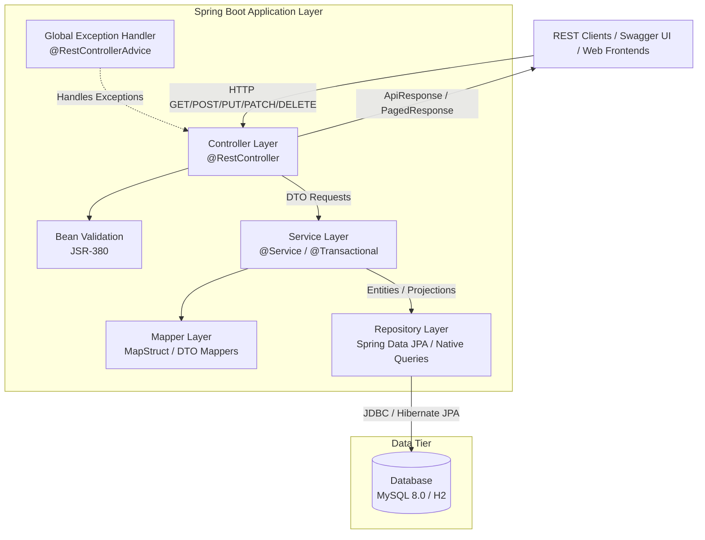
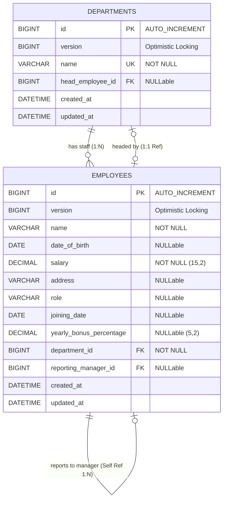
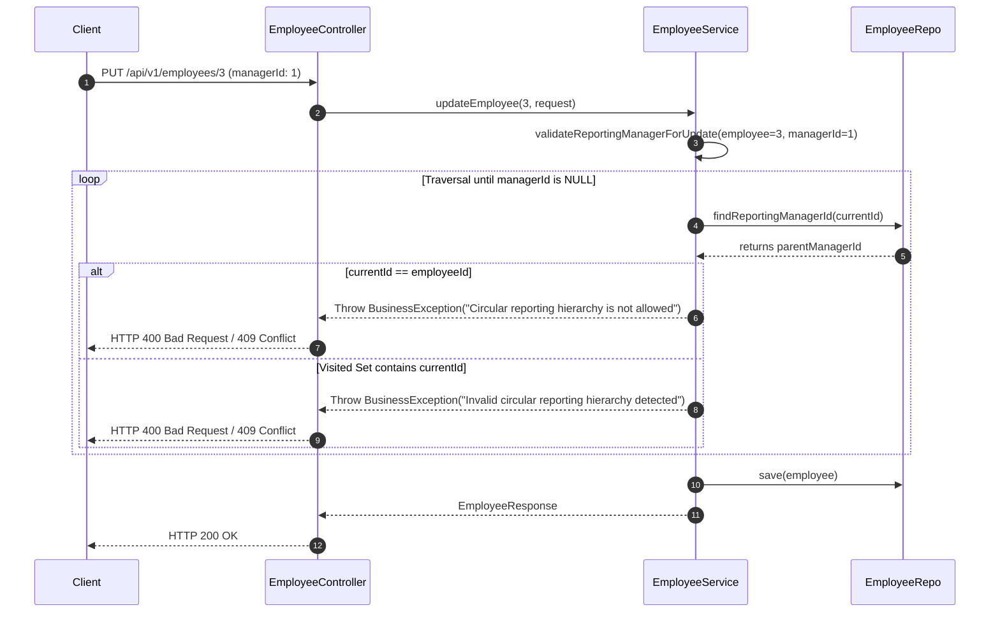

# Software Design Document (SDD)
## Enterprise Employee & Department Management System API

---

### Document Control & Metadata

| Attribute | Details |
| :--- | :--- |
| **Document Title** | Software Design Document: Employee Management System |
| **Author** | Senior Software Engineer |
| **Target Framework** | Java 21 / Spring Boot 3.x / Spring Data JPA |
| **Database Engine** | MySQL 8.0 / H2 Database Engine |
| **API Specification** | RESTful JSON API (OpenAPI 3.0 / Swagger) |
| **Status** | Approved for Production Implementation |
| **Version** | 1.0.0 |

---

## 1. Executive Summary & System Overview

### 1.1 Context & Objectives
The **Employee Management System (EMS)** is an enterprise-grade, RESTful backend microservice built using **Java 21** and **Spring Boot 3.x**. The platform provides core HR administration capabilities, enabling management of organizational structures (departments) and human resources (employees). 

Key business features include:
* Complete lifecycle management for Employees and Departments.
* Hierarchical reporting management with strict cycle detection.
* Automated department analytics generation (headcount, payroll, average compensation).
* Resource deletion safety rules (preventing deletion of active departments).
* Standardized pagination, dynamic resource expansion, and lightweight lookup endpoints.

### 1.2 Architectural Principles & Goals
1. **Clean Layered Architecture**: Strict separation of concerns across Controller, Service, Mapper, Repository, and Database layers.
2. **Defensive Domain Integrity**: Strict business invariant enforcement (e.g., circular reporting prevention, age vs. joining date validation, department head assignment rules).
3. **Optimized Query Performance**: Elimination of N+1 SELECT queries via targeted native aggregations, indexed foreign keys, and DTO projection queries.
4. **Standardized API Contracts**: Uniform JSON responses (`ApiResponse<T>`) and error responses (`ErrorResponse`) with explicit HTTP status code semantics.
5. **Zero Open-Session-In-View (OSIV)**: OSIV disabled (`spring.jpa.open-in-view=false`) to ensure transaction boundary discipline and prevent lazy-loading issues outside the service layer.

---

## 2. System Architecture & Component Design

### 2.1 High-Level Architecture Diagram



### 2.2 Layer Breakdown & Responsibilities

| Layer | Responsibility | Key Classes / Annotations |
| :--- | :--- | :--- |
| **Controller** | Handles HTTP requests, URL routing, input validation (`@Valid`), response serialization (`ResponseEntity<ApiResponse<T>>`). | `EmployeeController`, `DepartmentController` |
| **Service** | Implements core business logic, domain validations, transaction boundaries (`@Transactional`). | `EmployeeServiceImpl`, `DepartmentServiceImpl` |
| **Repository** | Data access abstraction, custom JPQL, native SQL aggregates, DTO projections. | `EmployeeRepository`, `DepartmentRepository` |
| **Entity / Model** | JPA persistent domain entities representing relational tables, entity relationships, pre-persist audit callbacks. | `Employee`, `Department` |
| **ExceptionHandler** | Intercepts runtime & validation exceptions to map them into standardized HTTP responses. | `GlobalExceptionHandler` |

---

## 3. Database Schema & Data Modeling

### 3.1 Entity-Relationship (ER) Diagram



### 3.2 Relational DDL Specification

```sql
-- Disable foreign key checks for clean table teardown
SET FOREIGN_KEY_CHECKS = 0;
DROP TABLE IF EXISTS employees;
DROP TABLE IF EXISTS departments;
SET FOREIGN_KEY_CHECKS = 1;

-- Table: departments
CREATE TABLE departments (
    id BIGINT AUTO_INCREMENT PRIMARY KEY,
    name VARCHAR(100) NOT NULL,
    version BIGINT DEFAULT 0,
    head_employee_id BIGINT NULL,
    created_at DATETIME(6) DEFAULT CURRENT_TIMESTAMP(6),
    updated_at DATETIME(6) DEFAULT CURRENT_TIMESTAMP(6) ON UPDATE CURRENT_TIMESTAMP(6),
    CONSTRAINT uk_department_name UNIQUE (name)
) ENGINE=InnoDB DEFAULT CHARSET=utf8mb4;

-- Table: employees
CREATE TABLE employees (
    id BIGINT AUTO_INCREMENT PRIMARY KEY,
    name VARCHAR(100) NOT NULL,
    version BIGINT DEFAULT 0,
    date_of_birth DATE NULL,
    salary DECIMAL(15, 2) NOT NULL,
    address VARCHAR(255) NULL,
    role VARCHAR(255) NULL,
    joining_date DATE NULL,
    yearly_bonus_percentage DECIMAL(5, 2) NULL,
    department_id BIGINT NOT NULL,
    reporting_manager_id BIGINT NULL,
    created_at DATETIME(6) DEFAULT CURRENT_TIMESTAMP(6),
    updated_at DATETIME(6) DEFAULT CURRENT_TIMESTAMP(6) ON UPDATE CURRENT_TIMESTAMP(6),
    CONSTRAINT fk_employee_department FOREIGN KEY (department_id) REFERENCES departments (id),
    CONSTRAINT fk_employee_manager FOREIGN KEY (reporting_manager_id) REFERENCES employees (id),
    INDEX idx_employee_department (department_id),
    INDEX idx_employee_manager (reporting_manager_id)
) ENGINE=InnoDB DEFAULT CHARSET=utf8mb4;

-- Cyclic FK back-reference for Department Head
ALTER TABLE departments
    ADD CONSTRAINT fk_department_head FOREIGN KEY (head_employee_id) REFERENCES employees (id);
```

---

## 4. API Endpoints & Contract Design

### 4.1 Endpoints Summary Matrix

| Method | Endpoint Path | Query Params | Function / Requirement | Status Code |
| :--- | :--- | :--- | :--- | :--- |
| `POST` | `/api/v1/employees` | - | Create a new employee | `200 OK` |
| `GET` | `/api/v1/employees/{id}` | - | Fetch detailed employee information | `200 OK` |
| `PUT` | `/api/v1/employees/{id}` | - | Update employee details | `200 OK` |
| `PATCH` | `/api/v1/employees/{id}/department` | - | Move employee to another department | `200 OK` |
| `GET` | `/api/v1/employees` | `lookup=true\|false`, `page`, `size` | Fetch all employees (or lightweight lookup list) | `200 OK` |
| `POST` | `/api/v1/departments` | - | Create a new department | `201 CREATED` |
| `GET` | `/api/v1/departments/{id}` | `expand=employee`, `page`, `size` | Fetch department (optionally with employees) | `200 OK` |
| `GET` | `/api/v1/departments` | `page`, `size` | Fetch all departments paginated | `200 OK` |
| `PUT` | `/api/v1/departments/{id}` | - | Update department details & head | `200 OK` |
| `DELETE`| `/api/v1/departments/{id}` | - | Delete department (fails if employees exist) | `200 OK` |
| `GET` | `/api/v1/departments/analytics` | `page`, `size` | Fetch department analytics data | `200 OK` |

---

### 4.2 Standard Response Wrapper Schemas

#### Standard Success Response (`ApiResponse<T>`)
```json
{
  "success": true,
  "message": "Operation completed successfully",
  "data": { ... }
}
```

#### Standard Paged Response (`PagedResponse<T>`)
```json
{
  "items": [ ... ],
  "pagination": {
    "page": 1,
    "size": 20,
    "totalElements": 25,
    "totalPages": 2
  }
}
```

#### Standard Error Response (`ErrorResponse`)
```json
{
  "success": false,
  "timestamp": "2026-09-04T11:30:00Z",
  "status": 409,
  "error": "Conflict",
  "errorCode": "DEPARTMENT_NOT_EMPTY",
  "message": "Department cannot be deleted because employees are assigned to it",
  "path": "/api/v1/departments/1",
  "fieldErrors": null
}
```

---

## 5. Detailed Business Logic & Algorithmic Designs

### 5.1 Circular Reporting Detection Algorithm
To prevent infinite loops and invalid organizational graphs (e.g., A -> B -> C -> A), updating an employee's reporting manager triggers an iterative cycle checking algorithm.



---

## 6. Non-Functional Requirements (NFRs) & Cross-Cutting Concerns

### 6.1 Exception Handling Architecture

| Exception Class | Trigger Condition | Mapped HTTP Status | Error Code | Log Level |
| :--- | :--- | :--- | :--- | :--- |
| `ResourceNotFoundException` | Entity ID not found in DB (Employee / Department / Manager) | `404 NOT_FOUND` | `RESOURCE_NOT_FOUND` | `WARN` |
| `BusinessException` | Business rule invariant broken or resource state conflict | `400 BAD_REQUEST` / `409 CONFLICT` | `BUSINESS_RULE_VIOLATION` / Custom | `WARN` |
| `ObjectOptimisticLockingFailureException` | Concurrent update on stale entity `@Version` | `409 CONFLICT` | `CONCURRENT_MODIFICATION` | `WARN` |
| `DataIntegrityViolationException` | Relational FK constraint / Unique index violation | `409 CONFLICT` | `DATA_INTEGRITY_VIOLATION` | `WARN` |
| `MethodArgumentNotValidException` | Payload failed JSR-380 `@Valid` checks | `400 BAD_REQUEST` | `VALIDATION_FAILED` | `WARN` |
| `ConstraintViolationException` | Path variable / Request parameter validation failure | `400 BAD_REQUEST` | `CONSTRAINT_VIOLATION` | `WARN` |
| `HttpMessageNotReadableException` | Malformed JSON / Data type parse mismatch | `400 BAD_REQUEST` | `INVALID_REQUEST_BODY` | `WARN` |
| `MethodArgumentTypeMismatchException` | Path variable type coercion mismatch (e.g. `/employees/abc`) | `400 BAD_REQUEST` | `TYPE_MISMATCH` | `WARN` |
| `HttpRequestMethodNotSupportedException` | Unsupported HTTP verb (e.g. POST to GET-only path) | `405 METHOD_NOT_ALLOWED` | `METHOD_NOT_SUPPORTED` | `WARN` |
| `HttpMediaTypeNotSupportedException` | Unsupported Content-Type header | `415 UNSUPPORTED_MEDIA_TYPE` | `UNSUPPORTED_MEDIA_TYPE` | `WARN` |
| `Exception.class` | Catch-all for unhandled system or runtime failures | `500 INTERNAL_SERVER_ERROR` | `INTERNAL_SERVER_ERROR` | `ERROR` (Stack Trace) |

---

## 7. Summary of Engineering Best Practices Applied
* **Strict Validation Rules**: JSR-380 validation annotations (`@NotBlank`, `@NotNull`, `@Positive`, `@DecimalMin`) applied to request DTOs.
* **Auditability**: Pre-persist (`@PrePersist`) and pre-update (`@PreUpdate`) lifecycle hooks in entities for consistent timestamp tracking (`created_at`, `updated_at`).
* **Immutability**: Java 21 `record` types utilized for DTO requests and responses.
* **Separation of Concerns**: Entity-to-DTO conversion encapsulated cleanly within dedicated Mapper components (`EmployeeMapper`, `DepartmentMapper`).